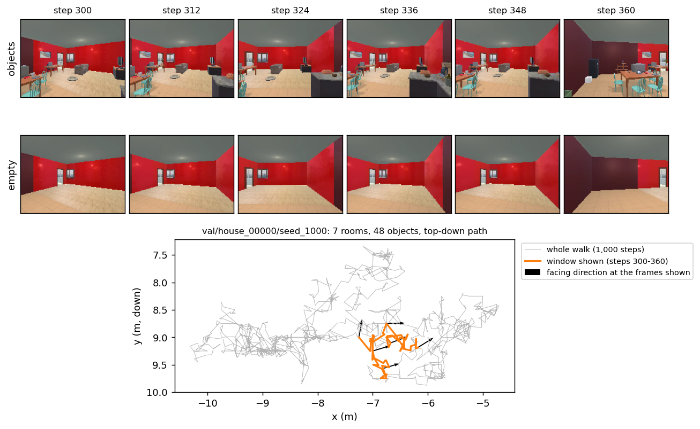

# ProcTHOR walks (`procthor-walks-objects`, `procthor-walks-empty`)

Two datasets of the same 24,000 first-person **random walks through simulated houses**. Each walk is 1,000 small steps
by a camera at eye height (1.45 m) through one procedurally generated house, rendered as a 160×120 video, with the
camera's exact position and heading at every step. In `procthor-walks-objects` the houses are furnished; in
`procthor-walks-empty` they are the *same* houses with every object removed, and the camera follows the *same* path.
So for every walk you have two videos that differ only in the furniture. That pairing, plus exact ground-truth motion
and a lot of data (24 million frames per dataset), makes them a clean testbed for world models: learn to predict the
next view from the current view and the movement.

The walks were generated and rendered by **Rupert Tawiah-Quashie** (Harvard Vision Lab graduate student) with
AI2-THOR 5.0.0 and the ProcTHOR-10k houses. Our lab copy repackages them in a compact, fast-loading format with split
tables, a loader, and this card.

## Source

**ProcTHOR-10k** is a set of 10,000 procedurally generated houses (1 to 10 rooms: kitchens, living rooms, bedrooms,
bathrooms) with furniture and small objects, varied wall and floor materials, and outdoor skyboxes seen through the
windows (Deitke et al., 2022). **AI2-THOR** is the Unity-based simulator that renders them (Kolve et al., 2017). Both
are Apache-2.0. ProcTHOR's own 10k-house split (10,000 train / 1,000 val / 1,000 test houses) is kept as-is.

How the walks were made (from the generator's per-walk metadata):

| | |
| --- | --- |
| houses | 10,000 train / 1,000 val / 1,000 test (ProcTHOR-10k) |
| walks | 2 per house (seeds 1000 and 1001): 24,000 per dataset |
| steps per walk | 1,000 frames, one per step |
| camera | 160×120 px, 90° horizontal field of view (73.7° vertical), 1.454 m above the floor, agent body invisible, physics paused |
| movement | Brownian: each step moves the camera by a random offset (Gaussian, σ = 0.1 m on each floor axis, *in any direction*, not only forward) and turns it by a random angle (Gaussian, σ = 0.15 rad ≈ 8.6°); positions are kept on the house's reachable floor |
| lighting | as shipped by ProcTHOR: time of day Midday 72 %, GoldenHour 23 %, BlueHour 5 %; 22 skyboxes, evenly used |
| empty houses | same rooms, walls, doors, windows, materials and lighting; all objects removed (`n_objects` = 0) |

Because steps go in any direction, the camera often drifts sideways or backwards relative to where it faces. A mean
step is 0.13 m (median 0.12 m); about 2 % of steps have zero displacement. There is no time axis: a step is a step,
not a fixed interval of time.

```bibtex
@inproceedings{deitke2022procthor,
  title={ProcTHOR: Large-Scale Embodied AI Using Procedural Generation},
  author={Deitke, Matt and VanderBilt, Eli and Herrasti, Alvaro and Weihs, Luca and Salvador, Jordi and Ehsani, Kiana and Han, Winson and Kolve, Eric and Farhadi, Ali and Kembhavi, Aniruddha and Mottaghi, Roozbeh},
  booktitle={Advances in Neural Information Processing Systems},
  year={2022}
}
@article{kolve2017ai2thor,
  title={AI2-THOR: An Interactive 3D Environment for Visual AI},
  author={Kolve, Eric and Mottaghi, Roozbeh and Han, Winson and VanderBilt, Eli and Weihs, Luca and Herrasti, Alvaro and Deitke, Matt and Ehsani, Kiana and Gordon, Daniel and Zhu, Yuke and Kembhavi, Aniruddha and Gupta, Abhinav and Farhadi, Ali},
  journal={arXiv preprint arXiv:1712.05474},
  year={2017}
}
```

## What our build adds

**Format.** Each walk is one record in a [slipstream](https://github.com/harvard-visionlab/slipstream) store: the
1,000 frames as one small MP4 (h264, full-resolution colour, near-lossless) plus the positions and headings. That is
12× smaller than the original files (2.4 MB vs 28 MB per walk) and decodes fast enough to feed a 4-GPU training run.
Side by side with the originals the frames are indistinguishable (average PSNR 43 dB furnished, 44.6 dB empty).

**Stores and sizes.** Each dataset is split into three stores, one per house folder, so you only download what you
use:

| store | walks | `procthor-walks-objects` | `procthor-walks-empty` |
| --- | ---: | ---: | ---: |
| train | 20,000 | 46.5 GB | 35.8 GB |
| val | 2,000 | 4.5 GB | 3.5 GB |
| test | 2,000 | 4.5 GB | 3.5 GB |

**Splits.** Two split tables, chosen with `split_version=`:

| version | train | val | other | what it is |
| --- | ---: | ---: | --- | --- |
| **`v1`** (default) | 20,000 | 2,000 | test 2,000 | ProcTHOR's house split: val and test houses never appear in train |
| `rtq-r160` | 18,000 | 2,000 | val_unseen 400, test 2,000, unused 1,600 | exactly what Rupert's r160 world-model runs used: train and val are both walks from *training* houses (for 90 % of val walks, the other walk of the same house is in train); `val_unseen` = 400 walks from unseen val houses |

Use `v1` for new work. Use `rtq-r160` only to reproduce or compare with Rupert's runs.

**Pairing.** A walk has the same `clip_id` (e.g. `val/house_00007/seed_1000`) and the same `record_idx` in both
datasets, so `objects[i]` and `empty[i]` are the same path through the same house.

### What a sample looks like

```python
from visionlab.datasets import load

ds = load("procthor-walks-objects", split="val")
print(ds)          # VideoDataset('procthor-walks-objects', split='val', ..., clips=2,000, ...)
ds.clips.head()    # one row per walk: record_idx, clip_id, house, seed, n_rooms, n_objects, time_of_day, ...
```

One record (= one walk):

| field | type / shape | meaning |
| --- | --- | --- |
| `video` | bytes | the walk as an MP4: 1,000 frames, 160×120 |
| `positions` | float32 `(1000, 2)` | camera (x, y) on the floor, metres, one row per frame |
| `headings` | float32 `(1000,)` | camera heading, radians in (−π, π], one per frame |
| `fps`, `num_frames`, `duration_s` | float / int / float | 30, 1000, 33.3 (30 fps is a file-format convention: frame *i* is step *i*) |

`ds.clips` also carries the generator's per-walk facts: `house`, `seed`, `n_rooms` (1–10, median 4), `room_types`,
`n_objects` (furnished: 1–96, median 26; empty: 0), `n_windows`, `n_doors`, `wall_materials`, `floor_materials`,
`time_of_day`, `skybox`, `mean_brightness`, `n_reachable` (number of reachable floor points), plus the camera
settings above.

**Ego-motion.** World models trained on these walks get the movement between consecutive frames *in the camera's own
axes*: the floor step rotated by the heading, plus the change of heading (wrapped to ±π):

```python
step = positions[1:] - positions[:-1]
c, s = np.cos(headings[:-1]), np.sin(headings[:-1])
ego = np.stack([step[:, 0] * c - step[:, 1] * s,          # dx_ego (m); moving right = +1
                step[:, 0] * s + step[:, 1] * c,          # dy_ego (m); moving forward = -1
                (np.diff(headings) + np.pi) % (2 * np.pi) - np.pi], -1)   # dtheta (rad)
```

This is the convention of Rupert's training code and of the generator's metadata
(`x_h = -x_unity, z_h = z_unity, heading = π - yaw_unity; forward -> dY_ego = -1, right -> dX_ego = +1`). Each
component has mean ≈ 0 and std 0.105 m, 0.105 m and 0.150 rad. The per-channel RGB mean/std his runs used are
`ds.stats`; the ego-motion normalisation constants are
`get_config("procthor-walks-objects").metadata["stats"]["egomotion"]` (`from visionlab.datasets.registry import
get_config`). A positive `dtheta` is a turn to the left: we checked this
against the images (scene content shifts right when `dtheta` > 0, correlation 0.81 over 108 pure turns). Plotted
top-down with the y axis pointing *down*, the camera faces `(-sin h, -cos h)` and the view is not mirrored.

## Quality and diversity (honest assessment)

- **Image quality: matches the originals.** Our MP4s average 43 dB (furnished) and 44.6 dB (empty) PSNR against the
  original frames, with no window below 37 dB in our checks; side by side they look identical. The renders themselves
  are low resolution (160×120) and synthetic: clean edges, no motion blur, no noise.
- **Scene diversity: large in layout, limited in style.** 10,000 houses with 1–10 rooms give many layouts, but the
  materials, furniture models and four room types repeat across houses; the look is unmistakably ProcTHOR.
- **Motion: random, not purposeful.** A Brownian walk jitters in place and drifts; it does not walk down corridors or
  through doors on purpose. A walk usually stays within a few metres (typical extent 3.6 m on each axis), often in
  one or two rooms. Because translation is in any direction, ego-motion has substantial sideways and backward
  components that a person walking would not.
- **Poses: exact.** Positions and headings come from the simulator, not from estimation.



The figure shows one val walk: the same 61-step window in the furnished and the empty house, and the whole path from
above with the window highlighted (arrows = facing direction). Regenerate with
`python -m datasets.prep.procthor_walks.card_figure --store-root <stores> --out datasets/cards/figures/procthor-walks-pair.png`.

## Usage

```python
from visionlab.datasets import load
ds = load("procthor-walks-objects", split="train")                              # or "procthor-walks-empty"
ds = load("procthor-walks-objects", split="train", split_version="rtq-r160")   # Rupert's training walks
```

**`split`** = **`"train"`** | `"val"` | `"test"` (and `"val_unseen"`, `"unused"` for `rtq-r160`). Only one store
is downloaded: the one that holds that split.

**Windows.** Rupert's world models train on 61-frame windows (20 frames of warm-up, 40 predicted, plus one) starting
at steps 0, 60, …, 900: 16 windows per walk. The MP4s have a keyframe every 60 frames, so each of those windows
decodes exactly its own 61 frames. With slipstream's `DecodeVideoWindow`, give each window's start as a time,
`t0 = (start + 0.5) / 30` (the half-frame keeps rounding from picking the neighbouring frame):

```python
import numpy as np
from slipstream.decoders import DecodeVideoWindow
from slipstream.loader import SlipstreamLoader

starts = np.arange(0, 901, 60)
recs = np.repeat(ds.indices, len(starts)); st = np.tile(starts, len(ds.indices))     # 16 windows per walk
stage = DecodeVideoWindow(T=61, rate_hz=30, t0_key="t0", num_workers=24, num_ffmpeg_threads=1)
loader = SlipstreamLoader(ds, batch_size=256, shuffle=True, seed=0, indices=recs,
                          sample_data={"t0": (st + 0.5) / 30, "start": st},
                          image_field="video", pipelines={"video": [stage]})
for batch in loader:
    frames = batch["video"]                 # [256, 61, 3, 120, 160] uint8
    start = batch["start"]                  # [256] window start step
    positions = batch["positions"]          # [256, 1000, 2] whole walk; slice [start : start + 61]
    headings = batch["headings"]            # [256, 1000]
```

Set `OMP_NUM_THREADS=1` before importing torch in any process that decodes. On one node, 24 decode threads give
roughly 800 windows/s.

To compare furnished and empty, load both and index the same `record_idx`. The step-by-step walk-through, with plots,
is `notebooks/datasets/procthor_walks_objects.ipynb` (and `..._empty.ipynb`).

### Where the data lives

`load()` looks in `$SLIPSTREAM_CACHE_DIR`, then downloads the one store it needs from the lab's private S3 bucket.
On FASRC all stores are already present in two places: the default `/n/lab_storage/alvarez_lab/Lab/datasets/slipstream`
(durable but slow) and `/n/netscratch/alvarez_lab/Lab/datasets/slipstream` (fast); for training set
`SLIPSTREAM_CACHE_DIR=/n/netscratch/alvarez_lab/Lab/datasets/slipstream`. The notebooks print the size and destination
before downloading anything.

## Methods (paste into your paper, then edit)

Replace every `{a | b}` with the value you used.

> We used egocentric random walks through ProcTHOR-10k houses (Deitke et al., 2022) rendered in AI2-THOR 5.0.0
> (Kolve et al., 2017) by R. Tawiah-Quashie (Harvard Vision Lab). Each walk comprises 1,000 steps of a camera 1.454 m
> above the floor (160×120 pixels, 90° horizontal field of view); at each step the camera position was displaced by an
> isotropic Gaussian offset (σ = 0.1 m per floor axis) constrained to reachable floor, and its heading by a Gaussian
> rotation (σ = 0.15 rad). Two walks (seeds) were generated per house in {furnished houses | the same houses with all
> objects removed | both versions, with identical camera paths}. We used {ProcTHOR's house split: 20,000 walks from
> 10,000 training houses, with 2,000 validation and 2,000 test walks from 1,000 held-out houses each | the split of
> Tawiah-Quashie: 18,000 training and 2,000 validation walks from training houses, and 400 walks from held-out houses}.
> Frames were stored as h264 video (4:4:4 chroma, CRF 10; mean PSNR {43.0 | 44.6} dB relative to the rendered frames).
> Training samples were {61}-frame windows starting every {60} steps; the movement between consecutive frames was given
> as the floor displacement in the camera's frame of reference plus the change in heading.

Credit R. Tawiah-Quashie for generating the walks, cite Deitke et al. (2022) and Kolve et al. (2017), and cite this
repository (`harvard-visionlab/datasets`, split `v1` / `rtq-r160`) for the stores and splits.

## Build details

Source files, encoding settings and why they were chosen, verification, and benchmarks:
`datasets/prep/procthor_walks/README.md`. Built 2026-10-08 with visionlab-datasets 0.18.0, slipstream 0.11.1.
