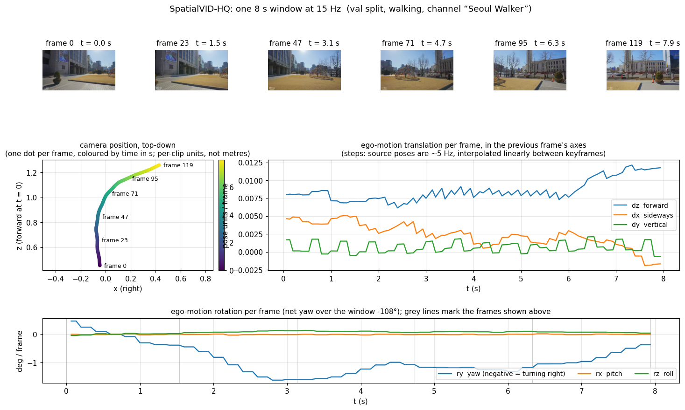

# SpatialVID-HQ (lab build)

SpatialVID-HQ is a collection of ~365k short video clips (up to 15 s each, most 8–15 s; 1,100 hours total) cut
from ~22k YouTube videos. Most of the footage is a moving camera in the real world: someone walking through a city or
a forest, a dashcam, a bike, a boat, a drone. What makes it useful is that every clip comes with an **estimated camera
trajectory**: where the camera was and which way it pointed, about five times per second. Our lab copy adds a
train/val/test split, a curated "person walking" subset, a fast loader, and camera poses interpolated to every frame.

Videos are 360p or lower (this is a _quality-filtered_ subset of the larger SpatialVID, not a high-resolution one).

## Source dataset

[SpatialVID-HQ](https://huggingface.co/datasets/SpatialVID/SpatialVID-HQ) is "a large corpus of in-the-wild videos
with diverse scenes, camera movements and dense 3D annotations such as per-frame camera poses, depth, and motion
instructions" (Wang et al., 2026; [project page](https://huggingface.co/SpatialVID)). HQ is the authors' curated
high-quality tier of the 7,000-hour SpatialVID corpus.

|                       |                                      |
| --------------------- | -----------------------------------: |
| clips                 |                              365,362 |
| source YouTube videos |                               22,543 |
| hours                 |                                1,112 |
| frames                |                              184.5 M |
| source frame rates    | mostly 60 and 30 fps (also 24/25/50) |

Per clip, the authors provide: camera position + rotation at keyframes (~5 Hz, estimated with MegaSaM, scale is
_not_ metric), camera intrinsics, a text caption, scene tags (scene type, time of day, weather, crowd density),
motion tags, and quality scores. Depth maps and dynamic masks exist upstream but are not in our build (ask George
if you need these for your research).

License: annotations CC BY-NC-SA 4.0; the videos belong to their YouTube uploaders (research use only, no
redistribution of frames). Our copy is therefore not public.

```bibtex
@inproceedings{wang2026spatialvid,
  title={SpatialVID: A large-scale video dataset with spatial annotations},
  author={Wang, Jiahao and Yuan, Yufeng and Zheng, Rujie and Lin, Youtian and Gao, Jian and Chen, Lin-Zhuo and Bao, Yajie and Zeng, Chang and Zhou, Yanxi and Long, Xiao-Xiao and others},
  booktitle={Proceedings of the IEEE/CVF Conference on Computer Vision and Pattern Recognition},
  pages={42592--42603},
  year={2026}
}
```

## What our build adds

Our copy is stored in [slipstream](https://github.com/harvard-visionlab/slipstream) format (one compact h265 MP4 per
clip, decoded on the fly), so a window of frames plus its camera poses can be pulled at thousands of frames per second.

**Train / val / test split.** The source dataset has no split, so we made one (version `v3`). All clips from one
YouTube video always land in the same split, and clips were balanced across scene type, time of day, weather, crowd
density, motion tags and carrier. Val holds out _whole videos_ from channels that also appear in train (same
distribution as train). Test holds out _seven whole channels_ never seen in train, so it measures transfer to new
creators. 66 clips (0.02 %) have corrupt pose files upstream and are excluded from everything.

| split (whole dataset) |   clips | videos | channels | hours |
| --------------------- | ------: | -----: | -------: | ----: |
| train                 | 334,494 | 20,939 |      129 | 1,020 |
| val                   |  16,932 |    729 |       63 |    50 |
| test                  |  13,870 |    872 |        7 |    42 |

**Person-walking subset.** The camera in the full set is carried by many things: a walking person, a car, a bike, a
train, a boat, a drone. For work on first-person locomotion we labelled each YouTube channel by _carrier_ and built a
subset of clips from a person-borne camera (hand-held, head-mounted, or on a stabiliser/chest rig), excluding clips
tagged stationary or moving implausibly fast. This subset is called `person_carried_v0` and it is what `load()`
returns by default. It is 58 % of the whole dataset.

| split (`person_carried_v0`) |   clips | videos | channels | hours |
| --------------------------- | ------: | -----: | -------: | ----: |
| train                       | 186,710 | 11,745 |       75 |   563 |
| val                         |  15,029 |    729 |       63 |    46 |
| test                        |  11,364 |    748 |        7 |    35 |
| total                       | 213,103 | 13,222 |       82 |   644 |

**Resolutions and frame rates.** Each clip is stored six ways: 640×360 or 456×256, at the source frame rate, 30 fps,
or 15 fps. The lower frame rates drop frames exactly (every 2nd or 4th), so frame times stay exact. See Usage for
which to pick.

**Per-frame camera poses.** The source poses are at ~5 Hz keyframes. We interpolate them (linear for position,
spherical-linear for rotation) to the exact time of every decoded frame, and convert them to frame-to-frame
**ego-motion**: how far the camera moved and turned since the previous frame, in the previous frame's own axes.

### What a sample looks like

```python
from visionlab.datasets import load

ds = load("spatialvid-hq", split="val")          # defaults: person_carried_v0, 456x256, 15 fps store
print(ds)     # VideoDataset('spatialvid-hq', split='val', subset='person_carried_v0', store=h265/456x256/15fps, clips=15,029, rate_hz=15)

rec = ds.record(ds.indices[0])                    # one clip's metadata + annotations (no pixels)
```

The record is a plain dict. The fields you will actually use:

| field                                                                  | type / shape     | meaning                                                                                                                                 |
| ---------------------------------------------------------------------- | ---------------- | --------------------------------------------------------------------------------------------------------------------------------------- |
| `video`                                                                | bytes            | the clip as an h265 MP4 (only when `with_video=True`; the loader decodes it for you)                                                    |
| `clip_id`, `source_id`                                                 | str              | SpatialVID clip id; YouTube id of the source video                                                                                      |
| `width`, `height`, `fps`, `num_frames`, `duration_s`                   | int / float      | of the stored video                                                                                                                     |
| `poses`                                                                | float32 `(n, 7)` | camera pose at each annotated frame: `[tx ty tz qx qy qz qw]`, world→camera, OpenCV axes (x right, y down, z forward), non-metric scale |
| `annot_frame_idx`                                                      | int32 `(n,)`     | which _source_ frame each pose row belongs to (time = idx / `src_fps`)                                                                  |
| `intrinsics`                                                           | float32 `(n, 4)` | normalised `[fx fy cx cy]` (multiply by width/height for pixels)                                                                        |
| `caption`                                                              | dict             | authors' generated description of the scene and camera motion                                                                           |
| `scene_type`, `time_of_day`, `weather`, `crowd_density`, `motion_tags` | str              | authors' tags, e.g. `"Urban;Street Scene"`, `"Daytime"`, `"Rainy"`, `"Sparse"`, `"right,forward"`                                      |

Also present: `src_fps`, `src_num_frames`, `group_id`, `instructions` (the authors' motion-instruction spans, e.g.
`{"0->3": ["Stay"], "3->62": ["Dolly In"]}`), `brightness`, and quality scores (`aesthetic_score`, `motion_score`, ...).
The caption is a dict with `SceneSummary`, `SceneDescription`, `CameraMotion`, `ShotImmersion`, `CategoryTags`,
`MotionTrends`; the summary of the record above reads *"A rainy Korean city street features a sidewalk, vehicles,
and apartment buildings, all bathed in a muted light under an overcast sky."*

`ds.clips` is a table with one row per selected clip (no pixels, no poses). It has the store columns above plus our
labels: `split`, `channel_id`, `channel_title`, `carrier` (`walk`, `rig`, `drive`, `bike`, `drone`, `boat`, `train`,
...), `in_subset`, and the coarse categories the split was balanced on: `scene_l1` (Urban / Interior / Natural
Landscape / Rural / Waterfront), `tod` (day / night / dawn_dusk / unknown), `weather_c` (Sunny / Cloudy / Rainy /
Snowy / other), `crowd` (Deserted / Sparse / Moderate / Crowded), `motion` (forward_only / turning / other),
`dur_bucket` (short / mid / long).

Training samples are not whole clips but **windows**: `T` frames at some rate starting at a random time in a clip,
returned as a `[B, T, 3, H, W]` uint8 tensor plus the true frame times, from which `ds.poses_at` gives `[B, T, 7]`
poses and `ds.ego_motion_at` gives `[B, T-1, 6]` deltas `[dx dy dz rx ry rz]` (translation in pose units, rotation as
a rotation vector in radians). See Usage.

## Quality and diversity (honest assessment)

- **Content diversity: moderate.** Scenes span cities, nature, indoor spaces, day and night, many countries. But the
  footage is YouTube "walking tour"/"drive" genres: long steady shots, little camera-to-object interaction, few faces
  up close. Channels are heavy-tailed: in the person-walking subset the top channel is 15 % of clips and the top
  ten are about half. Use `channel_cap=` (below) if that matters for you, and always report test (unseen channels).
- **Pose accuracy: good but unverified per clip.** Poses come from a structure-from-motion pipeline (MegaSaM) run by
  the authors. They are smooth and consistent within a clip in every clip we inspected, but scale is arbitrary per
  clip and there is no ground truth. Compare motion _within_ a clip, or normalise. The demo notebook
  (`notebooks/spatialvid_hq_loader_demo.ipynb`) plots frames next to the recovered camera path so you can judge for
  yourself.

  The figure below is one such window, chosen for a clear turn. The buildings sweep from right to left across the
  frames while the recovered path bends right and the yaw trace goes negative over the same seconds; that kind of
  agreement between pixels and poses is what to look for. Note the steps in the per-frame traces: the source poses
  are ~5 Hz and interpolated linearly, so frame-to-frame deltas are piecewise constant over ~3 frames at 15 Hz.

  

  Regenerate with `python -m datasets.prep.spatialvid_hq.card_figure --out datasets/cards/figures/spatialvid-hq-window.png`.

- **Text labels are machine-generated.** Captions and scene/weather/crowd tags were produced by vision-language
  models upstream and are noisy. Our `carrier` labels were reviewed by hand, but at the channel level, so a walking
  channel's occasional drone shot is labelled `walk`.

## Usage

```python
from visionlab.datasets import load
ds = load("spatialvid-hq", split="train")
```

Everything below is a keyword argument to `load`. Defaults are in bold.

**`split`** = **`"train"`** | `"val"` | `"test"` | `"all"`. Train on train, pick hyperparameters on val, report on
test. Test channels never appear in train, so test is the number that says whether you learned walking or learned
those creators.

**`subset`** = **`"person_carried_v0"`** | `"all"`. Default is the person-walking subset. Use `"all"` if you want
every carrier (driving, drones, boats...). The split labels are the same either way, so a model trained on the subset
can be evaluated on the whole-store test split.

**`where`** = a pandas query over the `ds.clips` columns listed above, for finer selection:
`where="carrier == 'walk'"`, `where="scene_l1 == 'Urban' and tod == 'night'"`, `where="dur_bucket == 'long'"`.
(The raw per-clip tags such as `time_of_day` live in the record, not in this table; use the coarse columns.)

**`channel_cap`** = fraction of clips any single channel may contribute (e.g. `0.02`). Randomly thins the dominant
channels. Use it if you suspect a model is memorising the two or three biggest creators.

**`rate_hz`** = the frame rate you will sample at (**15**). This picks the sparsest store that can serve that rate
exactly (15 Hz → 15 fps store; 10 or 30 Hz → 30 fps store; anything else → source rate). Alternatively **`fps`** =
`15` | `30` | `"native"` picks a store directly.

_Which frame rate?_ Decoding is the bottleneck and its cost scales with the _stored_ frame rate, not with how many
frames you keep: the 15 fps store trains about 35 % faster than the source-rate store for the same 15 Hz windows.
Use 15 Hz unless you need finer temporal resolution. At 15 Hz walking motion is smooth and poses are still
interpolated from the same 5 Hz keyframes, so nothing about pose accuracy changes with frame rate. Use 30 Hz for
fast motion or optical-flow-like targets. Use `fps="native"` only if you need every source frame.

**`res`** = **`"456x256"`** | `"640x360"`. Both are 16:9. 456×256 is 40 % fewer bytes and enough for 224-pixel
inputs; use 640×360 if you crop or need more detail.

### Windows, frames, poses

A **window** is the training sample: `T` consecutive frames at `RATE` Hz, starting at some time `t0` inside a clip.
Two things have to happen: choose `(clip, t0)` for each sample, and decode those frames. Decoding is done by a
slipstream pipeline stage, `DecodeVideoWindow`; choosing `t0` can be left to that stage or done by you.

**Simplest: let the stage pick a random start each epoch** (training).

```python
from slipstream.decoders import DecodeVideoWindow
from slipstream.loader import SlipstreamLoader

T, RATE, B = 120, 15.0, 8                                   # 8 s windows at 15 Hz, batch of 8
clips = ds.window_sampler(window_s=T / RATE).recs           # record indices of clips long enough for an 8 s window

stage = DecodeVideoWindow(T=T, rate_hz=RATE, seed=0, resize=224, device="cpu", num_workers=16)
loader = SlipstreamLoader(ds, indices=clips, batch_size=B, shuffle=True, seed=0, drop_last=True,
                          image_field="video", pipelines={"video": [stage]},
                          after_batch_transforms=[ds.ego_motion_transform()])

for epoch in range(n_epochs):
    for batch in loader:                                    # new clip order and new t0 draws every epoch
        frames = batch["video"]                             # [8, 120, 3, 224, 398] uint8
        poses = batch["poses"]                              # [8, 120, 7]  camera pose at each frame
        ego = batch["ego"]                                  # [8, 119, 6]  motion between consecutive frames
```

`indices` is the list of clips the loader iterates over: one window per clip per epoch, drawn uniformly from the
times where an 8 s window fits. The decode stage returns frames plus their true timestamps; the after-batch
transform looks up each clip's ~5 Hz poses, interpolates them to those timestamps and adds `poses` and `ego` to the
batch (`ds.ego_motion_transform(pad_first=True)` gives `ego` as `[B, T, 6]` with a zero row for frame 0, so it lines
up with `frames`). The `window_sampler` call is only there to drop clips shorter than the window
(the stage would otherwise clamp the window against the end of a short clip and repeat frames). Reproducibility
comes from the two seeds; the loader reseeds itself every pass, and `loader.set_epoch(e)` restores any epoch
exactly (checkpoint resume, DDP).

**Fixed starts** (evaluation, or several windows per clip). Draw `(clip, t0)` pairs yourself and hand them to the
loader as per-sample data; the stage then uses them instead of drawing its own:

```python
sampler = ds.window_sampler(window_s=T / RATE, anchors_per_clip=2, seed=0)
recs, t0 = sampler.sample(epoch=0)                          # two (clip, t0) pairs per clip; same seed → same pairs
stage = DecodeVideoWindow(T=T, rate_hz=RATE, t0_key="t0", resize=224, device="cpu", num_workers=16)
loader = SlipstreamLoader(ds, indices=recs, sample_data={"t0": t0}, batch_size=B, shuffle=False,
                          image_field="video", pipelines={"video": [stage]},
                          after_batch_transforms=[ds.ego_motion_transform()])
```

Here `indices` may repeat a clip and `t0` is aligned with it element for element. If you want fresh starts each
epoch in this mode you must call `sampler.sample(epoch)` again and build a new loader; for training the first form
does that for you.

**What is in a batch.** `batch["video"]` is `[B, T, 3, H, W]` uint8 on the stage's device. `resize=224` scales the
*short side* to 224 and keeps the aspect ratio (456×256 → 398×224); `resize=(H, W)` forces an exact size;
`resize=None` returns the stored size (456×256 or 640×360). `batch["video_t_sec"]` `[B, T]` is the true timestamp of
every decoded frame and `batch["video_rec"]` `[B]` the record index. `batch["poses"]` `[B, T, 7]` is the camera pose
at each frame (`[tx ty tz qx qy qz qw]`, world→camera) and `batch["ego"]` `[B, T-1, 6]` the motion between
consecutive frames, `[dx dy dz rx ry rz]`, in the earlier frame's camera axes: `ego[:, t-1]` is the move *into* frame
`t`. Walking forward is a steady positive `dz`; because poses are world→camera, a right turn is a *negative* `ry`. Without the transform, `ds.ego_motion_at(batch["video_rec"], batch["video_t_sec"])` computes the same two
arrays by hand. Per-channel RGB mean/std for normalisation are in `ds.stats`.

The full walk-through, with plots, is `notebooks/spatialvid_hq_loader_demo.ipynb`.

### Where the data lives

`load()` looks for the store in `$SLIPSTREAM_CACHE_DIR`, then the lab QNAP mount, then downloads the one store you
asked for from S3 (~170–310 GB each). On the lab machines the 456×256 stores are already staged; set
`OMP_NUM_THREADS=1` before importing torch in any process that decodes.

## Methods (paste into your paper, then edit)

Replace every `{a | b}` with the value you used and delete the rest. Numbers in brackets refer to the tables above.

**Full dataset.**

> We used SpatialVID-HQ (Wang et al., 2026), a corpus of 365,362 clips of up to 15 s (1,112 hours) cut from 22,543 YouTube videos
> of a moving camera in real-world scenes, each annotated with camera poses estimated at ~5 Hz by structure-from-motion.
> Because the released dataset has no canonical split, we used the visionlab-datasets split (version v3), which assigns
> whole source videos to a single split and is stratified over scene type, time of day, weather, crowd density, motion
> tags and camera carrier. The validation split (16,932 clips) holds out whole videos from channels present in
> training; the test split (13,870 clips) holds out seven entire channels absent from training. 66 clips with
> inconsistent pose annotations were excluded. Videos were re-encoded at {456×256 | 640×360} pixels and
> {15 | 30 | native} fps. Training samples were windows of {T} frames sampled at {15 | 30} Hz from random offsets within
> a clip; camera poses were interpolated to each frame time (linear translation, spherical-linear rotation) and
> expressed as frame-to-frame ego-motion in the previous frame's camera coordinates. [If used:] Channels were capped
> at {x}% of the training clips.

**Person-walking subset.**

> We used the `person_carried_v0` subset of SpatialVID-HQ (Wang et al., 2026), curated by visionlab-datasets:
> 213,103 clips (644 hours) from 13,222 YouTube videos across 82 channels in which the camera is carried by a walking
> person (hand-held, head-mounted, or on a stabiliser). Carrier was assigned by manual review of each channel and its
> video metadata; clips tagged stationary or exceeding a speed threshold (pose displacement / duration > 0.5) were
> removed. Camera poses are structure-from-motion estimates at ~5 Hz with per-clip (non-metric) scale. We used split
> v3, which assigns whole source videos to a single split and is stratified over scene type, time of day, weather,
> crowd density, motion tags and carrier: train 186,710 clips (75 channels), validation 15,029 clips (whole videos
> held out from training channels), test 11,364 clips (seven whole channels never seen in training). Videos were
> re-encoded at {456×256 | 640×360} pixels and {15 | 30 | native} fps. Training samples were windows of {T} frames
> sampled at {15 | 30} Hz from random offsets within a clip; camera poses were interpolated to each frame time (linear
> translation, spherical-linear rotation) and expressed as frame-to-frame ego-motion in the previous frame's camera
> coordinates. [If used:] Channels were capped at {x}% of the training clips.

Cite Wang et al. (2026) for the data, and this repository (`harvard-visionlab/datasets`, split v3 /
`person_carried_v0`) for the split and subset.

## Build details

For the curious or the reproducer: encoding settings, the exclusion list, the carrier review, split parameters, store
sizes and benchmarks are in [`spatialvid-hq.md`](spatialvid-hq.md) and `datasets/prep/spatialvid_hq/README.md`.
Build dates: stores 2026-09-13 to 2026-09-18, split v3 2026-09-17, software visionlab-datasets 0.9.0 /
slipstream 0.7.0.
